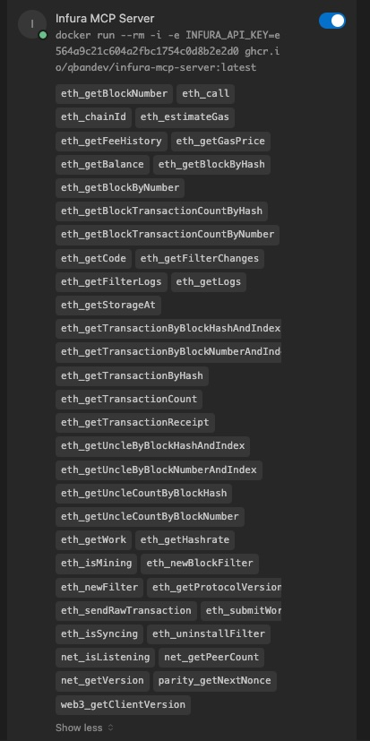
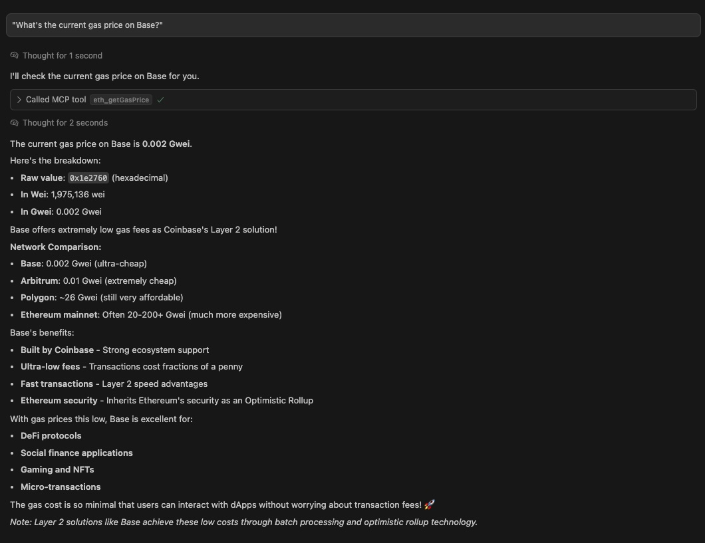

# Infura MCP Server

Connect Claude Desktop and you IDE (Cursor or VSCode) to Ethereum blockchain data through Infura's API.

## 🚀 Quick Start

### 1. Get Your Infura API Key

Sign up at [infura.io](https://infura.io) and create a new API key for Web3 API.

### 2. Setup for Claude Desktop

Add to your Claude Desktop config file:

```json
{
  "mcpServers": {
    "Infura MCP Server": {
      "command": "npx",
      "args": ["infura-mcp-server"],
      "env": {
        "INFURA_API_KEY": "your_infura_api_key_here"
      }
    }
  }
}
```

### 3. Setup for IDE Cursor

Add to your Cursor MCP settings:

```json
{
  "mcpServers": {
    "Infura MCP Server": {
      "command": "npx",
      "args": ["infura-mcp-server"],
      "env": {
        "INFURA_API_KEY": "your_infura_api_key_here"
      }
    }
  }
}
```



**Primary Networks**: `mainnet`, `optimism-mainnet`, `arbitrum-mainnet`, `polygon-mainnet`, `base-mainnet`, `sepolia`

**Additional Infura Networks**: `avalanche-mainnet`, `bsc-mainnet`, `celo-mainnet`, `linea-mainnet`, `mantle-mainnet`, `palm-mainnet`, `scroll-mainnet`, `starknet-mainnet`, `zksync-mainnet`, and [many more](https://docs.metamask.io/services/get-started/endpoints/)

### 5. Docker Setup (Alternative)

You can also run the MCP server using Docker:

```bash
# Pull the latest image
docker pull ghcr.io/qbandev/infura-mcp-server:latest
```

Add to your MCP config file:

```json
{
  "mcpServers": {
    "Infura MCP Server": {
      "command": "docker",
      "args": [
        "run", "--rm", "-i",
        "-e", "INFURA_API_KEY=your_infura_api_key_here",
        "-e", "INFURA_NETWORK=mainnet",
        "ghcr.io/qbandev/infura-mcp-server:latest"
      ]
    }
  }
}
```

**For Web Service Deployment (SSE Mode):**

```bash
# Pull the latest image
docker pull ghcr.io/qbandev/infura-mcp-server:latest

# Run as web service
docker run -d \
  --name infura-mcp-server \
  -p 3001:3001 \
  -e INFURA_API_KEY=your_infura_api_key_here \
  -e INFURA_NETWORK=mainnet \
  ghcr.io/qbandev/infura-mcp-server:latest \
  node mcpServer.js --sse
```

**Available Docker Tags:**
- `latest` - Latest stable release  
- `v0.1.1` - Specific version
- `main` - Development build from main branch

## ✨ What You Can Do



Once connected, ask Claude or Cursor to:

- **Check balances**: "What's the ETH balance of vitalik.eth?"
- **Get transaction details**: "Show me transaction 0x123..."
- **Read smart contracts**: "Call the balanceOf function on USDC contract"
- **Analyze blocks**: "What transactions were in the latest block?"
- **Estimate gas**: "How much gas would this transaction cost?"
- **Get network info**: "What's the current gas price?"

## 🔧 Troubleshooting

### Not Working?

1. Restart Claude or the IDE after configuration
2. Check your API key is valid at [infura.io](https://infura.io/dashboard)
3. Verify the config file path and JSON formatting

### Need Help?

- View available tools: Ask "What Ethereum tools do you have available?"
- Check connection: Ask "Can you check the current block number in Base?"

## 📚 Examples

```
"Get the balance of 0x742A4c... address"
"What's in block 18500000?"
"Call the totalSupply function on contract 0x123..."
"Get transaction receipt for 0xabc..."
"What's the current gas price on Polygon?"
```

---

**Ready to explore Blockchain with AI?** Just install and start asking questions! 🎯

